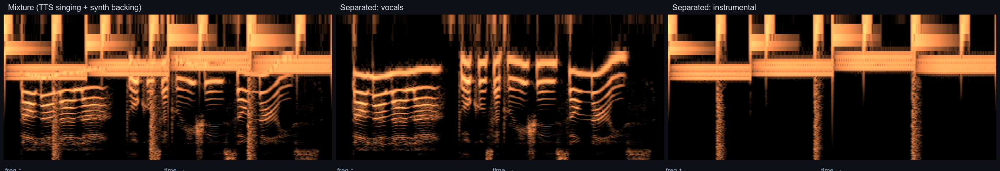

# uvr-lite

**English** | [简体中文](README.zh-CN.md)


**A lightweight vocal / instrumental separation tool** — one model file (~640 MB), a one-click installer, two lossless stems. Ships both a **Chinese desktop GUI (Windows)** and a **CLI**.

```bash
uvr-lite separate song.flac -o output
# → output/song-vocals.flac        (vocal stem)
# → output/song-instrumental.flac  (instrumental stem, = mix − vocals, mathematically lossless)
```

## Demo

Separation of a **MiMo TTS singing voice + synth backing** mixture (log-frequency spectrograms, cold → warm colormap):



- **Middle (vocals)**: smooth harmonic ridges following the melody — the singing voice is fully extracted
- **Right (instrumental)**: low-frequency energy band + percussive transients — the rhythm section is preserved

## Features

- **One-click install**: `install.bat` (Windows) / `install.sh` (Linux/macOS) — venv + dependencies + torch (CPU/CUDA auto-detection) + model download (SHA256 verified) + smoke test
- **Primary model**: BS-RoFormer ep317 (trained by viperx, SDR ≈ 10.9–12.9 dB) — a full track (~3 min) takes about **51 s** on an RTX 4060
- **Lossless output**: FLAC (16/24 bit) or WAV, original 44.1 kHz sample rate preserved
- **No GUI, no training code**: inference only, repo code < 1 MB
- Optional second model: `mel_band_karaoke` (Mel-Band RoFormer Karaoke, trained by aufr33 & viperx)

## Desktop GUI (Windows, recommended for non-technical users)

**Download** — one installer for everyone:
- [uvr-lite-setup.exe](https://github.com/KeS1Ke/uvr-lite/releases/latest/download/uvr-lite-setup.exe) — **~283 MB**, CPU torch built in (runs on any PC)

The base package is **self-contained** — Python, CPU PyTorch and the fp16-slimmed model (320 MB, ~50% smaller than the original 639 MB with inaudible output difference) are all inside; no downloads during installation. The **CUDA engine** (NVIDIA GPU acceleration) is optional and downloaded on demand (semi-online, same approach as UVR official):

1. **Double-click** the installer; pick an install location (default: your user folder) — everything lands in one folder, no scattering
2. **Optional**: tick "下载 CUDA 推理引擎" (downloads ~3.3 GB, ~4.9 GB on disk) if you have an NVIDIA GPU — fetched during install with a progress page + SHA256 verification; skip it and add it later any time
3. **Done** — a ♪ shortcut appears on your **desktop and Start menu**; double-click it to open the GUI
4. Drag songs in (or pick a folder), choose the model, click **开始分离** (Start Separation) — live progress + ETA; completed files get a ✓, unreadable formats get a ✗ before processing starts

Tips:

- **Inference engine**: choose **自动 / CPU / CUDA** in the GUI (auto picks the CUDA engine when a GPU is present, CPU otherwise); the switch takes effect after restarting uvr-lite
- **No GPU installed yet?** The GUI's **推理引擎** panel has a **下载 CUDA 引擎** button (resumable, multi-mirror fallback) — or run `uvr-lite install-cuda` from the CLI; install it whenever you like, no reinstall needed
- **Upgrade**: run the installer again — it overwrites in place and keeps your settings
- **Uninstall**: Control Panel → Programs and Features → uvr-lite (also available as `Uninstall.exe` in the install folder); removes shortcuts, registry settings and the install folder
- The GUI is in Chinese by design (target users: family & friends); the CLI below remains for power users

## Quick Start

### One-click install

**Windows**

```bat
install.bat
```

**Linux / macOS**

```bash
bash install.sh
```

The script: creates a virtual environment `.venv` → detects an NVIDIA GPU (CUDA build of torch, or CPU build otherwise) → installs dependencies → downloads the model (~320 MB, fp16-slimmed, SHA256 verified) → runs a smoke test on GPU setups.

### Manual install

```bash
python -m venv .venv && source .venv/bin/activate   # Windows: .venv\Scripts\activate.bat (PowerShell: .venv\Scripts\Activate.ps1)
pip install -e .
uvr-lite download                                    # download the model (~320 MB)
```

## Usage

> **Before each use**, activate the virtual environment (the installer's activation is not persistent). Pick the command for your shell:
>
> **pwsh (PowerShell 7+)** (Windows) — open via Win+R → `pwsh` or Start menu "PowerShell 7"; install with `winget install Microsoft.PowerShell` if missing
> ```powershell
> .venv\Scripts\Activate.ps1
> # if blocked by execution policy, run once in that shell: Set-ExecutionPolicy -Scope CurrentUser RemoteSigned
> ```
>
> **powershell (Windows PowerShell 5.1, built-in)** (Windows) — open via Win+R → `powershell` or Start menu "Windows PowerShell"
> ```powershell
> .venv\Scripts\Activate.ps1
> # if blocked by execution policy, run once in that shell: Set-ExecutionPolicy -Scope CurrentUser RemoteSigned
> ```
>
> Both shells share the **same `Activate.ps1` and the same `.venv`** — only the entry command differs (`pwsh` vs `powershell`), so you can mix them freely. Execution policy is remembered **per shell**; set it once in whichever shell blocks you. After activating, verify with `uvr-lite --version`.
>
> **cmd** (Windows)
> ```bat
> .venv\Scripts\activate.bat
> ```
>
> **bash** (Linux / macOS)
> ```bash
> source .venv/bin/activate
> ```
>
> Or call the binary directly: `.venv/bin/uvr-lite` (Windows: `.venv\Scripts\uvr-lite.exe`).

```bash
# Single file
uvr-lite separate song.mp3 -o output

# Multiple files / explicit format & bit depth
uvr-lite separate a.flac b.wav -o out --format flac --pcm 24

# Alternative model
uvr-lite separate song.flac -m mel_band_karaoke

# Low-VRAM GPUs: smaller batch size prevents OOM
uvr-lite separate song.flac --batch-size 1

# Speed/quality knob: 1 = no overlap (~2× faster), 2 = default, higher = smoother
uvr-lite separate song.flac --num-overlap 1

# List models / force re-download
uvr-lite models
uvr-lite download --force

# Install the CUDA engine for GPU acceleration (~3.3 GB, resumable)
uvr-lite install-cuda
```

| Option | Description |
|---|---|
| `-m, --model` | `bs_roformer_ep317` (default) / `mel_band_karaoke` |
| `--format` | `auto` (flac/wav chosen by peak level, default) / `flac` / `wav` |
| `--pcm` | FLAC bit depth `16` / `24` (default) |
| `--device` | `auto` (default) / `cpu` / `cuda` / `mps` |
| `--bigshifts N` | Number of circular time-shift passes; >1 improves quality at linear cost (default 1) |
| `--batch-size N` | Inference batch size (default from model config); set `1` on low-VRAM GPUs |
| `--num-overlap N` | Overlapping chunk count (speed/quality knob): `1` = no overlap (~2× faster), `2` = default, higher = smoother edges |
| `--tta` | Test-time augmentation (polarity/channel inversion averaging, 3× runtime, off by default) |

**Notes**

- **mp3 input** requires libsndfile ≥ 1.1 (bundled on Windows; on Linux install `libsndfile1` or upgrade the `soundfile` package)
- **CPU inference** runs at roughly 6× real-time (a 3-min track ≈ 17 min) — a GPU is recommended
- **Disk space**: ~1.2 GB after installing the CPU package; +~4.9 GB if you add the CUDA engine
- **Model SHA256** is verified once and cached (`*.verified` marker) — subsequent runs skip the full-file hash

## How It Works

```
input audio → soundfile+soxr decode (44.1 kHz, m4a via audioread) → (optional normalization)
            → BigShifts circular time-shift averaging → BS-RoFormer forward (vocals mask)
            → instrumental = mix − vocals (mathematically lossless)
            → soundfile writes FLAC/WAV
```

- **Engine**: `msst/` is an **inference-only subset** of [ZFTurbo Music-Source-Separation-Training](https://github.com/ZFTurbo/Music-Source-Separation-Training) (training/validation/ensemble/GUI removed, only the RoFormer family inference path kept)
- **Model**: the default model is hosted on this repo's [GitHub Releases](https://github.com/KeS1Ke/uvr-lite/releases/tag/models) as an **fp16-slimmed** checkpoint (320 MB; `scripts/strip_model.py` converts the original, load-time is transparently cast back to fp32 with an ~-80 dB output difference); the original [TRvlvr/model_repo](https://github.com/TRvlvr/model_repo) weights remain as fallback mirrors. SHA256-verified, kept out of git
- **Batch processing** reuses one loaded model across all files (`Separator` session) — a multi-file queue no longer reloads the 640 MB checkpoint per file
- **Layout**

```
uvr-lite/
├── uvr_lite/          # CLI package: separate / download / models commands
│   ├── engine.py      #   separation engine (bigshifts averaging, lossless instrumental)
│   ├── models.py      #   model registry (URL + SHA256)
│   ├── download.py    #   streaming download + integrity check + CUDA engine installer
│   └── configs/       #   model config yaml files
├── msst/              # vendored inference engine (ZFTurbo MSST subset, MIT)
├── install.bat|sh     # one-click installers
└── scripts/           # optional extras: analyze (DSP) / compose (procedural) / render_spectro (spectrograms)
```

### Optional companion scripts

`scripts/` provides three pure-numpy tools (independent of the separation core, numpy/Pillow only):

- `scripts/analyze.py` — DSP track analysis (BPM / key / chords / structure / timbre stats) → Markdown report
- `scripts/compose.py` — procedural music engine (reproducible melody + arrangement synthesis)
- `scripts/render_spectro.py` — log-frequency spectrogram rendering (PNG; the demo image above was generated by it)

## Credits

This is an independent repository (not a fork): the code is our own CLI wrapper plus a ZFTurbo MSST inference subset; the models share the **Ultimate Vocal Remover** ecosystem. Thanks to:

- **[Ultimate Vocal Remover GUI](https://github.com/Anjok07/ultimatevocalremovergui)** (Anjok07/aufr33, MIT) — the reference project in vocal separation; our model ecosystem and design are inspired by it
- **[ZFTurbo / Music-Source-Separation-Training](https://github.com/ZFTurbo/Music-Source-Separation-Training)** (MIT) — source of the inference engine and training framework; `msst/` is a trimmed subset
- **viperx / aufr33** — trainers of the BS-RoFormer and Mel-Band RoFormer models
- **[TRvlvr/model_repo](https://github.com/TRvlvr/model_repo)** — model weight hosting

Per the MIT license: third-party projects using these models must credit UVR and its developers.

## License

MIT License — see [LICENSE](LICENSE). The `msst/` subdirectory retains the original ZFTurbo MSST copyright notice.
