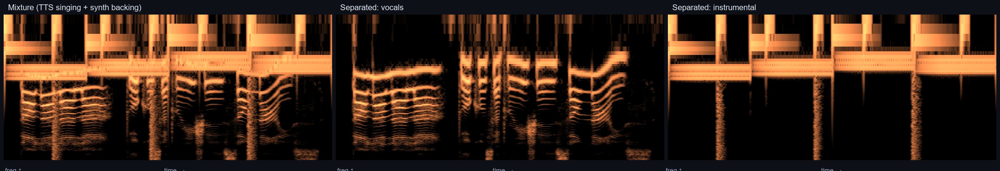

# uvr-lite

**English** | [简体中文](README.zh-CN.md)


**A lightweight vocal / instrumental separation & mixing tool** — one model file (320 MB, fp16 safetensors), a one-click installer, two lossless stems, and one-command mixing of the stems back into a full track. Ships both a **Chinese desktop GUI (Windows)** and a **CLI**.

```bash
uvr-lite separate song.flac -o output
# → output/song-vocals.flac        (vocal stem)
# → output/song-instrumental.flac  (instrumental stem, = mix − vocals, mathematically lossless)

uvr-lite mix output/song-vocals.flac output/song-instrumental.flac -o mixed
# → mixed/song-mix.flac            (stems combined back into the full track)
```

## Demo

Separation of a **MiMo TTS singing voice + synth backing** mixture (log-frequency spectrograms, cold → warm colormap):



- **Middle (vocals)**: smooth harmonic ridges following the melody — the singing voice is fully extracted
- **Right (instrumental)**: low-frequency energy band + percussive transients — the rhythm section is preserved

## Features

- **One-click install**: `install.bat` (Windows) / `install.sh` (Linux/macOS) — venv + dependencies + torch (CPU/CUDA auto-detection) + model download (SHA256 verified) + smoke test
- **Primary model**: BS-RoFormer ep317 (trained by viperx, SDR ≈ 10.9–12.9 dB) — a full track (~3 min) takes about **51 s** on an RTX 4060
- **Lossless output**: FLAC (16/24 bit) or WAV. Input is resampled to the model sample rate (both configs are 44100 Hz) and then written
- **Stem mixing**: combine vocals + instrumental back into the full track (the inverse of separation); exact summation by default (recovers the original mix from same-source stems), adjustable vocal/instrumental gain, optional peak normalization; available in both the CLI and the desktop GUI
- **No training code**: inference only; repository source is about 1 MB
- Optional second model: `mel_band_karaoke` (Mel-Band RoFormer Karaoke, trained by aufr33 & viperx)

## Desktop GUI (Windows, recommended for non-technical users)

**Download** — one installer for everyone:
- [uvr-lite-setup.exe](https://github.com/KeS1Ke/uvr-lite/releases/latest/download/uvr-lite-setup.exe) — **~283 MB**, CPU torch built in (64-bit Windows 10 or later)

The base package is **self-contained** — Python, CPU PyTorch and the fp16-slimmed model (320 MB, ~50% smaller than the original 639 MB, a size figure taken from upstream notes and not independently verified here) are all inside; no downloads during installation. The **CUDA engine** (NVIDIA GPU acceleration) is optional and downloaded on demand (semi-online, same approach as UVR official):

1. **Double-click** the installer; pick an install location (default: your user folder) — everything lands in one folder, no scattering
2. **Optional**: tick "下载 CUDA 推理引擎" (downloads ~3.3 GB, about 4.7 GB on disk) if you have an NVIDIA GPU — fetched during install with a progress page + SHA256 verification; skip it and add it later any time
3. **Done** — a ♪ shortcut appears on your **desktop and Start menu**; double-click it to open the GUI
4. Drag songs in (or pick a folder), choose the model, click **开始分离** (Start Separation) — live progress + ETA; completed files get a ✓, unreadable formats get a ✗ before processing starts

Tips:

- **Stem mixing**: the **功能** (mode) dropdown at the bottom switches between **人声/伴奏分离** (separation) and **音轨合成（人声＋伴奏）** (mixing). On the mixing page, drag in vocal/instrumental files (or pick a folder) and they pair automatically; the list shows **✓** paired / **✗** missing counterpart. Adjust vocal/instrumental gain, output format/bit depth and peak normalization, then click **开始合成** (Start Mixing). Mixing loads no model (pure DSP, takes seconds)
- **Inference engine**: choose **自动 / CPU / CUDA** in the GUI (auto picks the CUDA engine when a GPU is present, CPU otherwise); the switch takes effect after restarting uvr-lite
- **Minimize to tray** (optional, off by default): when checked, minimizing hides the window in the notification area instead of the taskbar. Closing the window still exits. The tray menu can show the window again or quit.
- **No GPU installed yet?** The GUI's **推理引擎** panel has a **下载 CUDA 引擎** button (resumable, multi-mirror fallback) — or run `uvr-lite install-cuda` from the CLI; install it whenever you like, no reinstall needed
- **Upgrade**: run the installer again — it overwrites in place and keeps your settings
- **Uninstall**: Control Panel → Programs and Features → uvr-lite, the Start menu item 「卸载 uvr-lite」, or `unins000.exe` in the install folder. Shortcuts, registry settings and the install folder are removed; `logs` in the install folder are kept
- The GUI is in Chinese by design (target users: family & friends); the CLI below remains for power users

## Quick Start

### One-click install

**Windows**

```bat
install.bat
```

**Linux / macOS**

```bash
bash install.sh
```

The script: creates a virtual environment `.venv` → detects an NVIDIA GPU (CUDA build of torch, or CPU build otherwise) → installs dependencies → downloads the model (~320 MB, fp16-slimmed, SHA256 verified) → runs a smoke test on GPU setups.

### Manual install

```bash
python -m venv .venv && source .venv/bin/activate   # Windows: .venv\Scripts\activate.bat (PowerShell: .venv\Scripts\Activate.ps1)
pip install -e ".[ui]"                               # [ui] = GUI extras (PySide6); drop it for a CLI-only setup
uvr-lite download                                    # download the model (~320 MB)
uvr-lite ui                                          # start the desktop GUI
```

## Usage

> **Before each use**, activate the virtual environment (the installer's activation is not persistent). Pick the command for your shell:
>
> **pwsh (PowerShell 7+)** (Windows) — open via Win+R → `pwsh` or Start menu "PowerShell 7"; install with `winget install Microsoft.PowerShell` if missing
> ```powershell
> .venv\Scripts\Activate.ps1
> # if blocked by execution policy, run once in that shell: Set-ExecutionPolicy -Scope CurrentUser RemoteSigned
> ```
>
> **powershell (Windows PowerShell 5.1, built-in)** (Windows) — open via Win+R → `powershell` or Start menu "Windows PowerShell"
> ```powershell
> .venv\Scripts\Activate.ps1
> # if blocked by execution policy, run once in that shell: Set-ExecutionPolicy -Scope CurrentUser RemoteSigned
> ```
>
> Both shells share the **same `Activate.ps1` and the same `.venv`** — only the entry command differs (`pwsh` vs `powershell`), so you can mix them freely. Execution policy is remembered **per shell**; set it once in whichever shell blocks you. After activating, verify with `uvr-lite --version`.
>
> **cmd** (Windows)
> ```bat
> .venv\Scripts\activate.bat
> ```
>
> **bash** (Linux / macOS)
> ```bash
> source .venv/bin/activate
> ```
>
> Or call the binary directly: `.venv/bin/uvr-lite` (Windows: `.venv\Scripts\uvr-lite.exe`).

```bash
# Single file
uvr-lite separate song.mp3 -o output

# Multiple files / explicit format & bit depth
uvr-lite separate a.flac b.wav -o out --format flac --pcm 24

# Alternative model
uvr-lite separate song.flac -m mel_band_karaoke

# Low-VRAM GPUs: smaller batch size prevents OOM
uvr-lite separate song.flac --batch-size 1

# Quality tier: fast / standard / high = overlap 1 / 2 / 4.
# fast suits CPU; high is cleaner. Do not combine with --num-overlap.
uvr-lite separate song.flac --quality fast

# Stem mixing: combine vocals + instrumental back into the full track (exact summation by default)
uvr-lite mix output/song-vocals.flac output/song-instrumental.flac -o mixed

# Batch mixing: scan a folder and auto-pair (*-vocals + *-instrumental)
uvr-lite mix --batch output -o mixed

# List models / force re-download
uvr-lite models
uvr-lite download --force

# Install the CUDA engine for GPU acceleration (~3.3 GB, resumable)
uvr-lite install-cuda
```

| Option | Description |
|---|---|
| `-m, --model` | `bs_roformer_ep317` (default) / `mel_band_karaoke` |
| `--format` | `auto` (flac/wav chosen by peak level, default) / `flac` / `wav` |
| `--pcm` | FLAC bit depth `16` / `24` (default) |
| `--device` | `auto` (default) / `cpu` / `cuda` / `mps` |
| `--bigshifts N` | Number of circular time-shift passes; >1 improves quality at linear cost (default 1) |
| `--batch-size N` | Inference batch size (default from model config); set `1` on low-VRAM GPUs |
| `--quality` | `fast` / `standard` / `high` (overlap 1 / 2 / 4). fast suits CPU; high is cleaner. The default tier is standard (overlap 2). Mutually exclusive with `--num-overlap` |
| `--num-overlap N` | Explicit overlap count. If neither this nor `--quality` is passed, the model config is used (2 for ep317; the karaoke config's own overlap is 4). Passing `--quality`, or a quality tier in the GUI, overrides that config |
| `--tta` | Test-time augmentation (polarity/channel inversion averaging, 3× runtime, off by default) |

`bs_roformer_ep317` is already this app's vocal model. `mel_band_karaoke` separates lead vocal from backing vocals; it is not a cleaner vocal/instrumental split. Larger overlap smooths chunk seams: fast (overlap 1) is the CPU choice, standard (overlap 2) is the default tier, and high (overlap 4) is cleaner at about twice the runtime of standard. The karaoke model's own overlap is 4, but a quality tier in the GUI (or `--quality`) overrides it explicitly.

`mix` subcommand options:

| Option | Description |
|---|---|
| `--out, -o` | Output directory (default `./output`) |
| `--batch DIR` | Scan a folder and auto-pair by filename for batch mixing |
| `--format` | `auto` (flac/wav chosen by peak level, default) / `flac` / `wav` |
| `--pcm` | Output bit depth `16` / `24` (default) |
| `--vocal-gain` | Vocal gain multiplier (default `1.0`) |
| `--inst-gain` | Instrumental gain multiplier (default `1.0`) |
| `--normalize` | Normalize peak to -1 dBFS (prevents clipping when summing; off by default for exact summation) |

Pairing is filename-based and case-insensitive: vocals `-vocals` / `_vocals`, instrumental `-instrumental` / `_instrumental` / `-inst` / `_inst`; extensions may differ.

**Notes**

- **mp3 input** requires libsndfile ≥ 1.1 (bundled on Windows; on Linux install `libsndfile1` or upgrade the `soundfile` package)
- **CPU inference** runs at roughly 6× real-time (a 3-min track ≈ 17 min) — a GPU is recommended
- **Disk space**: ~1.2 GB after installing the CPU package; about +4.7 GB if you add the CUDA engine
- **Model SHA256** is verified once and cached (`*.verified` marker) — subsequent runs skip the full-file hash
- **CUDA engine ABI**: the bundled wheel is `cp312/win_amd64` only, so `install-cuda` (and the GUI's download button) requires **64-bit Windows + Python 3.12** — which is what the official installer ships. On any other interpreter the command stops with an explanatory error instead of downloading 3.3 GB that cannot import; the CPU engine is unaffected. For GPU acceleration elsewhere, install the CUDA build of torch from PyPI: `pip install torch --index-url https://download.pytorch.org/whl/cu128`

## How It Works

```
input audio → soundfile+soxr decode (m4a via audioread) → resample to the model sample rate (44100 Hz in both configs) → (optional normalization)
            → BigShifts circular time-shift averaging → BS-RoFormer forward (vocals mask)
            → instrumental = mix − vocals (mathematically lossless)
            → soundfile writes FLAC/WAV
```

**Stem mixing** (`mix`, the inverse of separation):

```
vocals + instrumental → soundfile+soxr decode → resample to the higher sample rate
                      → fit channels / fit length → gain-summed mix
                      → (optional peak normalization) → soundfile writes {stem}-mix.flac|wav
```

- **Exact summation**: same-source stems are summed exactly by default (`instrumental = mix − vocals`), so the original mix is recovered without normalization; the higher sample rate wins, mono is duplicated to match channels, and lengths are zero-padded/truncated to the longest
- **Engine**: `msst/` is an **inference-only subset** of [ZFTurbo Music-Source-Separation-Training](https://github.com/ZFTurbo/Music-Source-Separation-Training) (training/validation/ensemble/GUI removed, only the RoFormer family inference path kept)
- **Model**: the default model is hosted on this repo's [GitHub Releases](https://github.com/KeS1Ke/uvr-lite/releases/tag/models) as an **fp16-slimmed safetensors** file (320 MB; `scripts/strip_model.py` converts the original — half the size, no pickle deserialization surface, load-time transparently casts back to fp32 for inference). SHA256-verified, kept out of git; the downloader has built-in multi-segment concurrency and retries
- **Batch processing** reuses one loaded model across all files (`Separator` session) — a multi-file queue no longer reloads the 320 MB fp16 model per file
- **Layout**

```
uvr-lite/
├── uvr_lite/          # CLI package: separate / mix / download / models commands
│   ├── engine.py      #   separation engine (bigshifts averaging, lossless instrumental)
│   ├── mix.py         #   mixing engine (vocals + instrumental sum, inverse of separation)
│   ├── stems.py       #   stem pairing (*-vocals / *-instrumental auto-pairing)
│   ├── audio_io.py    #   decode/resample/scan (shared by mixing and the CLI, no torch)
│   ├── errors.py      #   shared cancellation exception
│   ├── models.py      #   model registry (URL + SHA256)
│   ├── download.py    #   streaming download + integrity check + CUDA engine installer
│   ├── configs/       #   model config yaml files
│   └── ui/            #   desktop GUI (PySide6)
├── msst/              # vendored inference engine (ZFTurbo MSST subset, MIT)
├── install.bat|sh     # one-click installers
└── scripts/           # optional extras: analyze (DSP) / compose (procedural) / render_spectro (spectrograms)
```

### Optional companion scripts

`scripts/` provides three pure-numpy tools (independent of the separation core, numpy/Pillow only):

- `scripts/analyze.py` — DSP track analysis (BPM / key / chords / structure / timbre stats) → Markdown report
- `scripts/compose.py` — procedural music engine (reproducible melody + arrangement synthesis)
- `scripts/render_spectro.py` — log-frequency spectrogram rendering (PNG; the demo image above was generated by it)

## Credits

This is an independent repository (not a fork): the code is our own CLI wrapper plus a ZFTurbo MSST inference subset; the models share the **Ultimate Vocal Remover** ecosystem. Thanks to:

- **[Ultimate Vocal Remover GUI](https://github.com/Anjok07/ultimatevocalremovergui)** (Anjok07/aufr33, MIT) — the reference project in vocal separation; our model ecosystem and design are inspired by it
- **[ZFTurbo / Music-Source-Separation-Training](https://github.com/ZFTurbo/Music-Source-Separation-Training)** (MIT) — source of the inference engine and training framework; `msst/` is a trimmed subset
- **viperx / aufr33** — trainers of the BS-RoFormer and Mel-Band RoFormer models
- **[TRvlvr/model_repo](https://github.com/TRvlvr/model_repo)** — model weight hosting

Per the MIT license: third-party projects using these models must credit UVR and its developers.

## License

MIT License — see [LICENSE](LICENSE). `msst/` comes from ZFTurbo Music-Source-Separation-Training (MIT). Some files do not keep the upstream copyright header; attribution is in [msst/NOTICE.md](msst/NOTICE.md).
